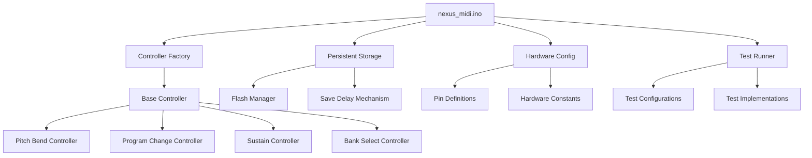

# Nexus MIDI Controller Refactoring Plan

## Overview
This document outlines the refactoring strategy for the Nexus MIDI controller codebase, transforming it from a monolithic structure into a modular, maintainable architecture following SOLID principles.

## Current Structure Analysis

### Main Components Identified:
1. **Hardware Configuration**
   - Pin definitions (ch9-ch15, aux1-aux6)
   - Hardware-specific constants

2. **Flash Memory Management**
   - Flash utility class for persistent storage
   - Save delay mechanism
   - Flash instances for program change and bank select

3. **MIDI Controllers**
   - Generic controller template
   - Pitch bend controller
   - Program change controller
   - Sustain controller
   - Bank select controller
   - Controller instances

4. **Test Framework**
   - Multiple test defines
   - Test-specific implementations

5. **Main Application**
   - Setup function
   - Loop function (with test and production variants)

## Proposed Modular Structure

```
250721-175828-lpmsp430g2553/
├── include/
│   ├── config/
│   │   ├── hardware_config.hpp      # Pin definitions and hardware constants
│   │   └── test_config.hpp          # Test configuration defines
│   ├── storage/
│   │   ├── flash_manager.hpp        # Flash memory interface
│   │   └── persistent_storage.hpp   # Save delay mechanism
│   ├── controllers/
│   │   ├── base_controller.hpp      # Base controller template
│   │   ├── pitch_bend_controller.hpp
│   │   ├── program_change_controller.hpp
│   │   ├── sustain_controller.hpp
│   │   ├── bank_select_controller.hpp
│   │   └── controller_factory.hpp   # Controller instantiation
│   ├── test/
│   │   └── test_runner.hpp          # Test functionality
│   ├── midi.hpp                     # (existing)
│   └── util.hpp                     # (existing)
├── src/
│   ├── config/
│   │   └── hardware_config.cpp      # Hardware configuration implementation
│   ├── storage/
│   │   ├── flash_manager.cpp        # Flash memory implementation
│   │   └── persistent_storage.cpp   # Save delay implementation
│   ├── controllers/
│   │   ├── pitch_bend_controller.cpp
│   │   ├── program_change_controller.cpp
│   │   ├── sustain_controller.cpp
│   │   ├── bank_select_controller.cpp
│   │   └── controller_factory.cpp
│   ├── test/
│   │   └── test_runner.cpp          # Test implementations
│   └── nexus_midi.ino               # Main file with setup() and loop()
└── platformio.ini
```

## Refactoring Steps

### Step 1: Hardware Configuration Module
**Files to create:**
- `include/config/hardware_config.hpp`
- `src/config/hardware_config.cpp`

**Content to extract:**
- Pin definitions (ch9-ch15, aux1-aux6)
- Noise window constant
- Control range constants (min_x, max_x)
- analog_read() function

### Step 2: Flash Storage Module
**Files to create:**
- `include/storage/flash_manager.hpp`
- `src/storage/flash_manager.cpp`
- `include/storage/persistent_storage.hpp`
- `src/storage/persistent_storage.cpp`

**Content to extract:**
- flash struct definition
- flash_b and flash_c instances
- Save delay mechanism (save_delay, save_delay_start_time, reset_save_delay())

### Step 3: Base Controller Architecture
**Files to create:**
- `include/controllers/base_controller.hpp`

**Content to extract:**
- Generic controller template
- Common controller interface

### Step 4: Individual Controllers
**Files to create (for each controller):**
- Header and implementation files for:
  - pitch_bend_controller
  - program_change_controller
  - sustain_controller
  - bank_select_controller

**Content to extract:**
- Controller struct definitions
- Controller-specific logic

### Step 5: Controller Factory
**Files to create:**
- `include/controllers/controller_factory.hpp`
- `src/controllers/controller_factory.cpp`

**Purpose:**
- Instantiate and manage all controller instances
- Provide centralized access to controllers

### Step 6: Test Framework
**Files to create:**
- `include/config/test_config.hpp`
- `include/test/test_runner.hpp`
- `src/test/test_runner.cpp`

**Content to extract:**
- Test defines
- Test-specific implementations (note struct, test loop logic)

### Step 7: Main Application Refactoring
**File to modify:**
- `src/nexus_midi.ino`

**Remaining content:**
- Include statements for new modules
- Global midi_out instance
- setup() function
- loop() function

## Key Principles to Maintain

1. **Single Responsibility**: Each module handles one specific aspect
2. **Open/Closed**: Controllers can be extended without modifying base code
3. **Liskov Substitution**: All controllers follow common interface
4. **Interface Segregation**: Minimal, focused interfaces
5. **Dependency Inversion**: Depend on abstractions, not concrete implementations

## Global Variable Preservation

All global variables will maintain their original linkage:
- `midi_out` remains in main file
- Controller instances moved to controller_factory
- Flash instances moved to flash_manager
- Hardware constants moved to hardware_config

## Build Validation Strategy

After each extraction step:
1. Run `pio run` to validate compilation
2. Check for any linkage errors
3. Verify no functionality is broken
4. Ensure all includes are properly resolved

## Architecture Diagram



## Benefits of This Architecture

1. **Modularity**: Each component can be developed and tested independently
2. **Maintainability**: Clear separation of concerns makes updates easier
3. **Testability**: Individual components can be unit tested
4. **Reusability**: Controllers can be reused in other projects
5. **Scalability**: New controllers can be added without modifying existing code
6. **Clarity**: File structure reflects logical organization